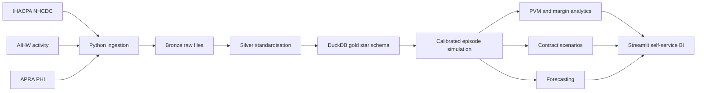

# Casemix Revenue Intelligence

**Private Hospital Funding & Contract Performance Analytics**

[](https://github.com/ozzy2438/Casemix-Revenue-Intelligence-Private-Hospital-Funding-Contract-Performance-Analytics/actions/workflows/ci.yml)
[](https://www.python.org/)
[](LICENSE)

A commercial analytics build for private hospital health-fund revenue
management, using Australia's national hospital costing, activity and private
health insurance data.

The solution gives a Health Funds Team a reproducible way to assess casemix,
explain revenue movements, identify margin pressure and model contract terms
before negotiation.

> **Headline scenario:** under the calibrated demo activity, a 5% indexed
> DRG-based contract produces a **A$91.3M three-year margin**, while a 3%
> indexed per-diem contract produces a **A$796.7M loss**. These are modelled
> scenario outputs, not actual hospital-group financial results.

## Decision Products

| Decision need | Analytical product |
|---|---|
| Why did revenue change? | Reconciled price-volume-mix bridge |
| Which services are commercially exposed? | DRG margin and margin-squeeze analysis |
| Which payer relationships need attention? | Fund-level revenue, cost and margin views |
| Which contract structure is sustainable? | DRG vs per-diem scenario modeller |
| What activity and revenue should we plan for? | SARIMAX and Prophet forecasts |
| How can leaders explore results themselves? | Four-page Streamlit self-service dashboard |

## Reproducible Findings

The deterministic demo build generates 50,000 synthetic episodes calibrated to
published national distributions.

- **Contract structure dominates indexation:** DRG-based 5% indexation returns
  A$91.3M over three years; per-diem 3% returns -A$796.7M.
- **Revenue bridge reconciles exactly:** the A$155.8M year-on-year increase is
  decomposed into +A$159.2M volume, -A$3.6M mix and +A$0.2M rate, with A$0
  residual.
- **Current health-fund scope:** A$357.0M revenue, A$13.5M margin, 21,911
  separations and a 2.55 casemix index in the default dashboard view.
- **Negotiation focus is visible at DRG level:** high-complexity, high-volume
  services can be ranked by absolute margin, margin per separation and outlier
  exposure.

See [Executive Summary](docs/executive_summary.md) for the decision narrative.

## Self-Service Application

Run the application after building the demo warehouse:

```bash
python -m scripts.build_demo
streamlit run streamlit_app.py
```

The application provides:

1. **Executive Summary** - revenue, cost, margin, casemix and commercial risks.
2. **Casemix Explorer** - DRG complexity, volume and margin drill-down.
3. **Payer Performance** - health-fund revenue, cost and margin comparison.
4. **Contract Modeller** - live indexation, daily-rate, outlier-cap and horizon
   controls.

All pages share financial year, hospital and health-fund filters.

## Architecture



### Gold Model

- `gold.fact_episodes`: one synthetic, nationally calibrated hospital separation
- `gold.fact_national_costs`: DRG cost weights and national cost benchmarks
- `gold.fact_phi_benefits`: payer, state and period benefit metrics
- `gold.dim_drg`, `dim_hospital`, `dim_payer`, `dim_period`
- `gold.v_casemix_index`, `v_drg_revenue`, `v_payer_performance`

Full definitions are in the [Data Dictionary](docs/data_dictionary.md).

## Data Sources and Governance

| Source | Agency | Use |
|---|---|---|
| National Hospital Cost Data Collection | IHACPA | DRG cost weights, LOS and cost benchmarks |
| AR-DRG Data Cubes and MyHospitals | AIHW | Activity, same-day and hospital distributions |
| Quarterly Private Health Insurance Statistics | APRA | Benefits, membership and payer calibration |

Patient-level episode data is not publicly available. The project therefore
uses synthetic episode records calibrated to public aggregate distributions.
Every episode is marked `is_synthetic = TRUE`, source lineage is retained, and
the methodology is documented in [Methodology](docs/methodology.md).

This distinction is deliberate: public national inputs are real; patient-level
records and hospital contract terms are simulated for privacy-safe analytical
demonstration.

## Quick Start

```bash
git clone https://github.com/ozzy2438/Casemix-Revenue-Intelligence-Private-Hospital-Funding-Contract-Performance-Analytics.git
cd Casemix-Revenue-Intelligence-Private-Hospital-Funding-Contract-Performance-Analytics

python -m venv .venv
source .venv/bin/activate
python -m pip install -r requirements.txt

python -m scripts.build_demo
python -m pytest models/data_quality.py tests -q
streamlit run streamlit_app.py
```

Add `--include-forecast` to the build command to fit SARIMAX and Prophet models:

```bash
python -m scripts.build_demo --include-forecast
```

## Repository Guide

```text
analysis/       Commercial analytics and forecasting
dashboard/      Reusable DuckDB access layer for self-service tools
docs/           Methodology, dictionary and executive communication
ingestion/      IHACPA, AIHW, APRA and MyHospitals clients
models/         DuckDB star schema and data quality tests
scripts/        Reproducible demo orchestration
simulation/     Nationally calibrated synthetic episode generator
tests/          Business logic and dashboard regression tests
streamlit_app.py
```

## Analytical Methods

### Price-Volume-Mix

For continuing DRGs:

```text
Volume = (Q1 - Q0) * base_mix_i * base_rate_i
Mix    = Q1 * (current_mix_i - base_mix_i) * base_rate_i
Rate   = Q1 * current_mix_i * (current_rate_i - base_rate_i)
```

New and discontinued DRGs are separated. A regression test requires the bridge
to reconcile to the observed revenue movement.

### Contract Scenarios

- **DRG-based:** cost weight x NWAU price x annual indexation
- **Per-diem:** length of stay x daily rate x annual indexation
- **Outlier handling:** configurable reimbursement cap for high-cost activity
- **Outputs:** revenue, cost, margin, margin percentage and outlier shortfall

### Forecasting

Quarterly separation, revenue and cost series can be forecast with SARIMAX and
Prophet, including 95% prediction intervals.

## Quality Controls

GitHub Actions rebuilds the warehouse and runs the complete test suite on every
push and pull request.

Current controls cover:

- primary key uniqueness and null checks
- foreign-key integrity
- valid cost-weight and financial ranges
- positive cost and benefit checks
- casemix and margin business rules
- contract scenario monotonicity
- dashboard aggregate reconciliation
- exact PVM bridge reconciliation

Run locally:

```bash
python -m pytest models/data_quality.py tests -q
```

## Role Alignment

This build demonstrates the core capabilities expected from a private hospital
commercial data scientist:

- DRG, NWAU, casemix and clinical-costing literacy
- health-fund revenue and contract scenario modelling
- SQL-based multidimensional healthcare analysis
- Python data engineering, statistics and forecasting
- production-minded data quality and CI/CD
- human-centred, self-service BI for executives and commercial teams
- transparent communication of assumptions, limitations and data provenance

See [Interview Talking Points](docs/interview_talking_points.md) for a concise
walkthrough.

## Limitations

- Results are analytical demonstrations, not actual hospital or payer outcomes.
- Episode records and contract rates are synthetic.
- National aggregate calibration does not reproduce every local clinical or
  operational correlation.
- Scenario models support negotiation decisions; they do not replace actuarial,
  legal or clinical review.

## License

Code is released under the [MIT License](LICENSE). Source datasets remain
subject to the originating agencies' terms.
