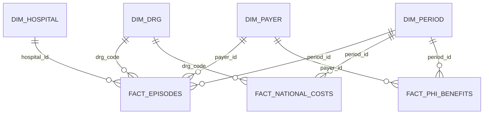

# Power BI Data Model

## Relationships

| From | Cardinality | To | Cross-filter |
|---|---|---|---|
| `dim_drg[drg_code]` | 1:* | `fact_episodes[drg_code]` | Single |
| `dim_hospital[hospital_id]` | 1:* | `fact_episodes[hospital_id]` | Single |
| `dim_payer[payer_id]` | 1:* | `fact_episodes[payer_id]` | Single |
| `dim_period[period_id]` | 1:* | `fact_episodes[period_id]` | Single |
| `dim_period[period_id]` | 1:* | `fact_phi_benefits[period_id]` | Single |
| `dim_payer[payer_id]` | 1:* | `fact_phi_benefits[payer_id]` | Single |
| `dim_period[period_id]` | 1:* | `fact_national_costs[period_id]` | Single |
| `dim_drg[drg_code]` | 1:* | `fact_national_costs[drg_code]` | Single |

Keep analysis output tables disconnected unless a page explicitly needs a
relationship. Scenario tables are intentionally disconnected so what-if
controls do not alter historical actuals.

## Model Conventions

- Prefix technical tables with `dim_` and `fact_`.
- Set currency formats to `A$#,0;[Red]-A$#,0`.
- Set margin percentages to `0.0%;[Red]-0.0%`.
- Sort quarter labels by `dim_period[quarter_start]`.
- Hide surrogate keys from report consumers.
- Use explicit measures instead of implicit column aggregation.
